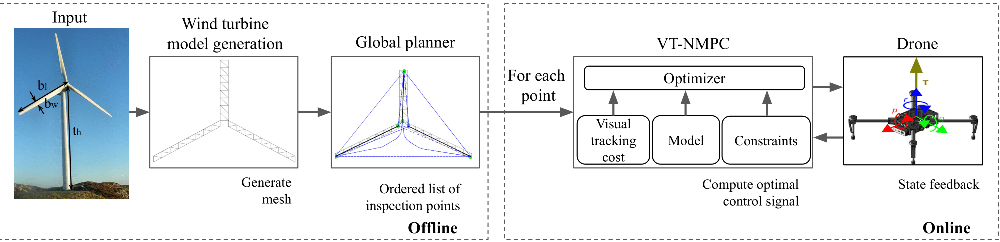

# Autonomous Wind Turbine Inspection Framework Enabled by Visual Tracking Nonlinear Model Predictive Control (VT-NMPC)


<p align=right>
<src="vtnmpc.gif" />
</p>


This repository contains the code and simulation files for the submitted paper title "Autonomous Wind Turbine Inspection Framework Enabled by Visual Tracking Nonlinear Model Predictive Control (VT-NMPC)". For this purpose, a time optimal path planner and a Visual tracking MPC is developed. 


We provide a general inspection framework, that takes the dimensions of the wind turbine as input, and provides the optimal attitude rate and thrust command to the drone to acheive time optimal coverage. 




The approach is modular, where the global plan for inspecting is provided through a time optimal graph based path planner. The output of the path planner is sequentially input to a NMPC with visual tracking costs, that allows the drone to acheive optimal pose relative to the surface for best heading, incidence angle and distance from the surface. More details on the method can be found soon through the paper submitted for publication.


**Installation instructions:**

 Install [Ubuntu 18.04](https://releases.ubuntu.com/18.04/)  and [ROS melodic](http://wiki.ros.org/melodic/Installation/Ubuntu) 

Clone directory in the home folder
```bash
cd
git clone git@github.com:open-airlab/VTNMPC-Autonomous-Wind-Turbine-Inspection.git
```
Download the PX4 folder from here: [PX4 files download](https://drive.google.com/file/d/1BpnlglYMQI5q9lEwMCPNLGjPj5mzCoe5/view?usp=sharing) 
and place it inside the Wind-Turbine-Inspection folder


copy the folder the WTI_catkin inside the catkin_ws


Download mavros dependecies
```bash
sudo apt-get install ros-melodic-mavros*
sudo apt-get install xdotool
sudo apt-get ros-mavros-mav-msgs 
```

Build workspace
```bash
cd catkin_ws
catkin_make
```


 setup px4:
```bash
cd Wind-Turbine-Inspection
./install_dependencies_and_setup_px4_modified.sh
```
note: ignore the errors related to python 2.7 

Add alias for arming the drone and setting the mode to offboard.
```bash
sudo gedit ~/.bashrc
```
Add the following lines for
```bash
alias arm='rosrun mavros mavsafety arm'
alias disarm='rosrun mavros mavsafety disarm'
alias offboard='rosrun mavros mavsys mode -c OFFBOARD'
```


**Starting the simulation:**
```bash
cd Wind-Turbine-Inspection/WTI_px4_modified/shell_scripts/
./run_sitl_gazebo_withWrapper_terminator.sh matrice_100
```

Running the Inspection Planner

launch rqt_reconfigure trajectory 

```bash
roslaunch dji_m100_trajectory m100_trajectory_v2_indoor.launch 
```

Activate traj_on 


in the  terminal arm the dorne and set the mode to offboard on by typing the following commands
```bash
arm
offboard
```


The drone will take off.

**Launching the VT-NMPC:**

```bash
roslaunch quaternion_point_traj_nmpc quaternion_point_traj_nmpc.launch
```


**Adding wind to the simulation**
```bash
roslaunch dji_m100_trajectory windgen_recdata.launch
```


**Running the whole inspection frame work:**

The optimal sequence of points and surface normals are created in txt file format, which the NMPC uses to generate optimal control actions. The planner is run for a default wind turbine model.

To run the default planner: 
- Bring the drone to the initial position (-3, 0, 3)
- Run the point and normal generator node
```bash
rosrun dji_m100_trajectory GP_statemachine
```
- change the mode to GP (Global Planner) and tick point to inspect checkbox


